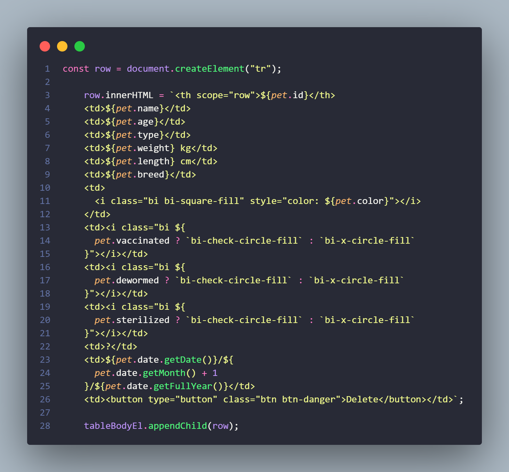

# Bài 2 - TOÁN TỬ

## I. Các toán tử

Bao gồm 4 loại chính :

1. Toán tử số học
2. Toán tử gán
3. Toán tử so sánh
4. Toán tử logic (bài 3)

### 1. Toán tử số học

Gồm có : `+` , `-`, `*`, `/`, `%`, `**` ,...
Chú ý toán tử lủy thừa ** : vd: x**3 = x^3

### 2. Toán tử gán

Ví dụ về 1 số toán tử gán


VD:

```
let a = b = c = 10;
console.log(a,b,c);
a += 10; // 20
b *=2; // 20
c %= 3; // 1
```

#### 2.1 Lưu ý về toán tử hậu tố, tiền tố (++ --) : <QUAN TRỌNG>

- Toán tưt `++` : tăng giá trị lên 1

- Toán tử `--` : giảm giá trị đi 1

- Tiền tố : Toán tử ở trước toán hạng , vd: ++x

  Sẽ thực hiện cập nhật giá trị cho biến trước , sau đó lấy giá trị đó để tính toán

- Hậu tố : Toán tử sau toán hạng , vd: x++

  Sẽ lấy giá trị củ để tính toán trước , sau đó mới cập nhật giá trị sau

VD:

```
let num = 10;
let res = num++ * 2 + ++num/2;
console.log(res);
```

### 3. Toán tử so sánh

- Bao gồm một số toán tử so sánh sau :


VD:

```
let x = 5;
x > 5;
x >=5;
```

<b>Lưu ý về toán tử == và === (sẽ nói rõ ở bài tiếp theo)</b>

### 5. Toán tử nối chuổi (+)

Phép toán + khi dùng cho các chuổi thì được gọi là phép nối chuổi , phép nổi chuổi có chức năng là tạo ra 1 chuổi mới bằng việc nối chuổi bên trái vào cuối chuổi bên phải.

VD:

```
let str1 = "Hello";
let str2 = "world";

let str = str1 + " " + str2;
console.log(str);

```

## II. Độ ưu tiên của toán tử

Khi chúng ta tính giá trị biểu thức thì phải tuân theo quy ước về thứ tự ưu tiên của các toán tử mà JS quy định.
Có nhiều loại toán tử khác nhau với các độ ưu tiên (hay tính kết hợp) khác nhau nhưng cơ bản nhất là một số tính kết hợp sau


VD :

```
12 + 12 * 3 / 2 + 3 * (4 + 5);

```

## III. Strings vàTemplate Literals <i><QUAN TRỌNG></i>

### 1. String

Chúng ta có thể biểu diễn 1 giá trị thuộc kiểu string bằng 3 cách sau :

- Dâu "" : vấn đề nháy đơn
- Dấu '' : vấn đề nháy kép
- Dùng dấu `` : từ <ES6>

==> Chúng ta có thể ghép nối các chuổi bằng phương thức `concat` hoặc dùng toán tử nổi chuổi `+`

VD:

```
let firstName = "Ngan";
let lasttName = "Tran";
let birthYear = 2000;

let info = "Tôi tên là " + firstName + " " + lasttName + " , năm nay tôi " + (2022 - birthYear) + " tuổi";

console.log(info);

```

==> Ta thấy , cách viết này không trực quan và đôi lúc khó nhìn, thiếu sự linh động
==> Vậy làm thế nào để viết 1 chuổi string 1 cách gọn gàng dể hiểu, linh hoạt hơn ??
======> Ta sẽ đùng `ES6 Template String`

### 2. Template String

VD về ES6 Template String :



- Được ra mắt trong phiên bản ES6
  Về cơ bản nó là 1 cú pháp , cho phép chúng ta viết biểu thức ${expression} bên trong chuỗi STRING

- Biểu thức bên trong template string sẽ được biểu diễn với cú pháp `${expression}`

VD:

```
let firstName = "Ngan";
let lasttName = "Tran";
let birthYear = 2000;

let info = "Tôi tên là " + firstName + " " + lasttName + ", năm nay tôi " + (2022 - birthYear) + " tuổi";
let info2 = `Tên tôi là ${firstName} ${lasttName}, năm nay tôi ${2022-birthYear} tuổi`;

console.log(info);
console.log(info2);
```

- Viết được cả biểu thức và hàm bên trong chuổi string

```
let x = 10;
let y = 20;
let sum = (num1, num2) => num1 + num2;

console.log("Tổng 2 số x và y là : " + (x + y));
console.log(`Tổng 2 số x và y là : ${sum(x, y)}`);
```

- Viết String trên nhiều dòng :

```
let str1 = "dòng 1\n" + "dòng 2\n" + "dòng 3.";
let str2 = `dòng 1
dòng 2
dòng 3.`;

console.log(str1);
console.log(str2);
```

VẬY ?? Lợi ích của việt sử dụng ES6 template string là gì nào ?

1. Sử dụng cặp dâu ``để biểu diễn ==> sẽ không cần quan tâm đến các ký tự đặc biệt như là " hay ' có bên trong chuổi của chúng ta
2. Giups ghép nối string đơn giản hơn, dể dàng hơn , không can dung toán tử + hay phương thức concat
3. Giúp viết string trên nhiều dòng 1 cách đơn giản
4. cho phép viết biểu thức và hàm bên trong chuổi ==> giúp ích cho việc code và xử lý
   các chuổi phức tạp và dài

## IV. Câu lệnh if- else

Cú pháp như sau ;

```
if (condition){
    // Code cho lệnh if
}
else{
    // Code cho lệnh else
    // khối else này có thể có hoặc không có cũng được
}
```

Khối code cho lệnh if sẽ được thực thi khi mà điều kiện condition có giá trị true
Ngược lại nếu condition có giá trị false thì sẽ thực hiện khối code cho lệnh else

VD:

```
let a = 10;
let b = 20;
if (a > b) {
  console.log("a lớn hơn b");
} else {
  console.log("a không lớn hơn b");
}
```

## V. Tổng kết:

1. Các dạng dữ liệu nguyên thủy cơ bản

==> Có 7 dạng :

- Ba dạng dữ liệu cơ bản nhất : number, string, boolean

- Bốn dạng dữ liệu ít sử dụng hơn: undefined, null, symbol và bigint

2. Các dạng biến khác nhau, các cách khai báo biến :

- Có 2 dạng biến khác nhau là :

* biến có thể thay đổi được giá trị (dùng let, var)
* biến không thể thay đổi giá trị ( dùng const)

- Có 3 cách để khai báo biến ;
  - let : có thể thay đổi giá trị (NÊN dùng khi chắc chắn có thay đổi giá trị của biến)
  - const : không thể thay đổi giá trị (NÊN dùng khi không thay đổi giá trị của biến )
  - var : có thể thay đổi giá trị (KHÔNG KHUYẾN KHÍCH DÙNG , nên dùng let và const)

3. Các toán tử cơ bản

- Toán tử số học
- Toán tử so sánh
- Toán tử gán
- Toán tử logic
  ==> Và tìm hiểu đọc thêm về độ ưu tiên của các toán tử

4. Cách sử dụng string :

- Nối chuổi dùng +
- Nối chuổi dùng phuong thức concat
- Dùng ES6 Template string để biểu diển 1 chuổi string
