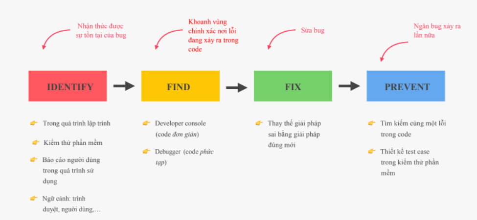

# Bài 6 - Trở thành lặp trình viên tốt

## I. Giới thiệu

- Bên cạnh việc viết được những dòng code có thể chạy và đáp ứng được yêu cầu bài toán hay giải quyết được vấn đề, chúng ta cần phải chú ý thêm đến chất lượng những đoạn code (như các quy tắc đặt tên biến, hàm sao cho hợp lý, rõ nghĩa, các đoạn code ngắn gọn không bị trùng lặp code, hay đảm bảo được tính module hóa ,...) . Và để trở thành 1 lập trình viên giỏi, mình nghĩ chúng ta cần có thêm một số kỹ nanwng khác để có thể làm việc hiệu quả, cũng như có một tư duy giải quyết vấn đề đúng đắn.
  ==> Do đó, trong bài học này, chúng ta sẽ tìm hiểu vê một số kỹ năng quan trọng đó mà chúng ta cần phải nắm bắt để có thể trở thành một lặp trình viên JS giỏi :

- Thiết lặp môi trường viết code
- Cách tư duy vf giải quyết vấn đề
- Debug - gỡ lỗi

## II. Thiết lặp Prettier và VS Code

Sử dụng Prettier cũng như các công cụ (plugins) định dang code khác làm cho code trong cùng một dự án trở nên nhất quán, đưa code về cùng một định dạng. Ngoài ra còn một số chức năng như tự động lưu, tự động thay đổi dấu ngoặc đơn, hàm mũi tên, ... Prettier cũng cung cấp khả năng cài đặt các cách định dạng mà mình muốn.

- Cài đặt Prettier :
  Vào phần Extensions tìm với từ khóa Prettier
  --> Chọn mục Prettier - Code formatter
  --> Ấn cài đặt

- Đặt Prettier là formater mặc định :
  Vào phần setting , nhập từ khóa default format --> chọn mục `Editor: Default Formatter`
  --> chọn đến mục `prettier - code formatter`

- Cài đặt tự động format code khi lưu (Ctrl + S):
  Vào phần setting , nhập từ khóa `format on save`
  --> Tích chọn vào mục `Editor: Format On Save`

==> Một số những lợi ích khi ta cài đặt extension `prettier`:

- Giúp tự động định dạng code của chúng ta 1 cách hợp lý khoa học và đúng chuẩn hơn
- Dể đọc dể nhìn và đọc code dể hiểu hơn
- Tiện lợi trong làm việc nhóm và nhiều người cùng format cùng 1 định dạng
- Tính năng tự động format khi lưu sẽ giúp chúng ta không cần quan tâm đến 1 số trường hợp khi code không đúng chuẩn format hay code bị xấu ,..

==> Ngoài ra chúng ta có thể cài thêm nhiều các extensions khác nếu muốn để thuận tiện cho chúng ta khi code

## III. Cài đặt Node.js và thiết lập Dev Environment

- Cài đặt Live Server (đã cài đặt ở bài 1 thậm chí là ở môn WEB)
- Cài đặt Node.js (Ở môn học hiện tại, chúng ta chưa cần thiết phải cài Node.js , nên chúng ta có thể bỏ qua phần này)

## IV. Tư duy giải quyết vấn đề và viết code hiệu quả

Từ bài giảng của jonas chúng ta cũng có thể rút ra một số ý cần lưu ý như sau

### 1. Những nguyên nhân phổ biến dẫn đến thất bại khi học code :

- Không có mục tiêu rõ ràng ngay từ đầu

- Bắt đầu bằng cách xem một bài khóa học và sao chép code một cách mù quáng mà không quan tâm nó hoạt động như thế nào

- Trong khi học không cố gắng củng cố kiến thức qua các ví dụ và làm các bài tập nhỏ hay ghi chép

- Bất cứ khi nào viết code một chút, nhanh chóng cảm thấy nhàm chán khi code không gọn hoặc không hiệu quả

- Nhanh mất đi động lực vì nghĩ rằng mình sẽ không bao giờ biết hết mọi thứ

- Luôn học một mình và không chia sẻ việc học cùng ai

- Sau mỗi khóa học nghĩ răng mình đã trở thành một lập trình viên web và nộp CV xin việc

### 2. Làm thế nào để học code hiệu quả hơn

- Lập một mục tiêu học tập cụ thể

- Thay vì sao chép hãy cố gắng hiểu chúng và cố gắng gõ code

- Củng cố kiến thức bằng cách áp dụng nó ngay khi có thể, tự thử thách bản thân

- Tự tạo một project và áp dụng các kiến thức đã học và tìm tòi thêm, luôn luôn phải thực hành không phụ thuộc vào người hướng dẫn và phải tự suy nghĩ thử thách cho bản thân và chinh phục chúng là cách để giỏi hơn

- Khi mới học chỉ cần viết nhiều code nhất có thể, clean code và hiệu quả sẽ đi kèm với thời gian và kinh nghiệm và có thể quay lại chỉnh sửa code bất cứ khi nào

- Chấp nhận sự thật là không bao giờ có thể biết hết được mọi thứ vì lập trình web là một lĩnh vực rộng lớn, không nên so sánh mình với những lập trình viên hàng đầu

- Không học một cách tách biệt mà nên học cùng nhau bởi vì việc giải thích cho người khác được có nghĩa là mình đã hiểu

- Hoàn thành khóa học không phải là trở thành lập trình viên, trở thành lập trình viên rồi nhưng cũng không thể ngừng học những cái mới

### 3. Cách tư duy của lập trình viên trong việc giải quyết vấn đề

==> Một các sai lầm thường thấy như :

- Nhảy thẳng vào vấn đề mà không suy nghĩ nhiều
- Thực hiện giải pháp không có cấu trúc rõ ràng
- Cách tiếp cận chưa hợp lý gây căng thẳng
- Không tham khảo tài liệu khi chưa đưa ra được giải pháp hiệu quả

==> Quy trình giải quyết vấn đề hiệu quả trong 4 bước sau :

Khi gặp 1 vấn đề luôn giữ bình tĩnh và suy nghĩ mọi thứ chậm lại, không nhảy thẳng cào 1 giải pháp mà không có kế hoạch, có một cách tiếp cận hợp lý, vận dụng 4 bước giải quyết vấn đề sau :

- Đảm bảo 100% là chúng ta hiểu VẤN ĐỀ, nhìn lại tổng thể bức tranh và đặt ra các câu hỏi đúng để có được cái nhìn rõ ràng về toàn bộ vấn đề

VD: 1 Hàm nhận vào tham số có thể là number, string, array . Và có chức năng là `đảo ngược` lại giá trị của tham số đó.
--> Vậy câu hỏi là tại sao tham số chỉ có thể là 3 loại dữ liệu trên ?

- Chiến thuật chia để trị : chia nhỏ vấn đề - từ vấn đè lớn ta bóc tách chia nhỏ thành những vấ đề nhỏ nhất mà ta có thể giải quyết để giải quyết các vấn đề nhỏ ấy từ đó lắp ráp để giải quyết hoàn toàn được vấn đề lớn nhất

VD: với bài toán ở trên : ta có thể chia nhỏ vấn đề thế này :
B1: Vì mỗi loại kiểu dữ liệu khác nhau ta cần có cách thực hiện đảo ngược khác nhau do đó, bước đầu tiên là cần phải xác định tham số đầu vào thuộc kiểu dữ liệu gì để có bước tiếp cận đảo ngược 1 cách phù hợp. --> Làm thế nào ?
B2: Sau khi đã biết được kiểu dữ liệu là gì thì ta sẽ chọn 1 trong cách sau để thực hiện đảo ngược theo từng kiểu dữ liệu tương ứng

--> Nếu là number thì tiên hành đảo ngược number ?? như thế nào ??
--> Nếu là string thì tiến hành đảo ngược string ?? như thế nào ??
--> Nếu là array thì tiến hành đảo ngược array ?? như thế nào ??

B3 : trả về giá trị đã được đảo ngược

Bây giờ ta tiến hành giải quyết từng vấn đề nhỏ để giải quyết được bài toán

- Khi thực hiện vấn đề nhỏ gặp khó khăn thì chúng ta không nên lo sợ và bỏ cuộc ngay mà nên tìm kiếm và nhờ sự trợ giúp từ các nguồn tài liệu trên mạng như (google, stacoverflow, MDN,...)

- Gộp các đoạn code lại với nhau tạo thành 1 bản pseudocode (code cho người hiểu) trước khi viết code thật (code cho máy hiểu)

```

Mã giã :

function daoNguoc(value)

	if typeof value == string
		// đảo ngược sring
		// trả về giá trị đảo ngược của value
	if typeof value == number
		// đảo ngược số
		// trả về giá trị đảo ngược của value
	if typeof value == array
		// đảo ngươc array
		// trả về giá trị đảo ngược của value

	return value


```

Code tham khảo :

```
function reverse(value) {
  if (typeof value === "number") {
    // 1 cách đơn giản là biến số thành string sau đó đảo ngược string đó
    value = String(value);
    let res = "";
    for (let i = value.length - 1; i >= 0; i--) {
      res = res + value[i];
    }

    // ép kiểu và trả về số đã đảo ngược
    return Number(res);
  }

  if (typeof value === "string") {
    let res = "";
    // dùng vòng lặp ngược để duyệt
    for (let i = value.length - 1; i >= 0; i--) {
      res = res + value[i];
    }
    return res;
  }

  if (value instanceof Array) {
    let res = value;
    let i = 0;
    let j = res.length - 1;

    // đảo vị trí các phần tử theo từng cặp (đầu - cuối)
    while (j > i) {
      let tmp = res[i];
      res[i] = res[j];
      res[j] = tmp;
      i++;
      j--;
    }
    return res;
  }

  return value;
}

const num = 123456789;
const str = "Hello World";
const arr = [1, 2, 3, 4, 5, 6, 7, 8, 9, 10];

console.log(reverse(num));
console.log(reverse(str));
console.log(reverse(arr));


```

==> Ngoài ra ta có thể áp dụng một số phương pháp sau trong thói quen lập trình: (mang tính cá nhân của mình)

- Chia nhỏ vấn đề
- Giảm sự cảm tính trong khi đưa ra quyết định bằng cách chia nhỏ vấn đề để lý trí hơn
- Phân bố mọi thứ 1 cách hợp lý
- Biết cách trừu tượng hóa và tối giản vấn đề
- Có thói quen ghi chép và comment trong code

## V. Gỡ lỗi (debug)

### 1. Debugging (Fixing Errors) :

==> Bug là gì ?

- Bug là một lỗi hoặc một vấn đề mà một chương trình máy tình gặp phải, nói các khác là bất kỳ hành vi, trạng thái không mong muốn nào xuất hiện trong một chương trình.

- Bug là một điều thường gặp khi phát triển một chương trình phần mềm, mọi chương trình phần mềm phức tạp đều có bug và có thể không phát hiện ra chúng trong nhiều năm

VD :

==> Quy trình debugging : về cơ bản là tìm kiếm bug, sữa chữa và ngăn chặn chúng


<br>

- Bước đầu tiên là IDENTITY (xác định), bắt đầu phát hiện ra bug, bug thường được phát hiện trong khi phát triển, những bug phát hiện muộn khi sản phẩm đã đến tay người dùng cuối sẽ gây ra nhiều hậu quả nghiêm trọng, chính vì thế việc phát hiện ra bug sớm là điều rất cần thiết. Trong khi xác định bug thì cũng phải xác định bối cảnh mà bug xảy ra. Ví dụ một số bug chỉ có thể xảy ra khi dùng trình duyệt nhất định, hoặc một số người dùng nhất định vì lí do nào đó.

- Bước thứ 2 là FIND (tìm), tìm bug đó ở đâu trong code. Với những code đơn giản thì ta có thể console, nhưng với code phức tạp thì phải dùng đến những công cụ debugging

- Bước thứ 3 là FIX (sửa), chỉnh sửa lại code

- Bước thứ 4 là PREVENT (ngăn chặn), ngăn chặn để bug đó sẽ không bao giờ xảy ra trong chương trình một lần nữa

### Debugging trên Console và với công cụ Breakpoints

Chúng ta có cách cách thông dụng sau để sữa lỗi :

- Đối với các lỗi đơn giản ta hay sử dụng console.log() để in ra các giá trị, các biến,.. để kiểm tra và sửa lỗi
- Đối với các lỗi phức tạp hơn thì ta có thể sử dụng breakpoints để kiểm tra và sữa lỗi ngay trên trình duyệt của chũng ta bằng cách đặt 1 breakpoint
- Ngoài ra , thay vì đặt breakpoint thủ công trên trình duyệt ta cũng co thể dùng câu lệnh debugger trong code mà chũng ta muốn debug , thì cũng sẽ có tác dụng tương tự như cách chúng ta đặc điểm ngắt breakpoint trên trình duyệt

VD :

```
"use strict";

// viết 1 hàm tính tổng của 2 số nhập từ người dùng

const getSum = function () {
  let num1 = prompt("Nhập số thứ nhất");
  let num2 = prompt("Nhập số thứ 2");

  const tong = num1 + num2;

  console.log(`Tổng của 2 số ${num1} và ${num2} là : ${tong}`);
};

getSum();

// // Một cách viết tối ưu hơn , để fix các lỗi

// const getSum = function () {
//   let num1 = Number(prompt("Nhập số thứ nhất"));
//   while (isNaN(num1)) {
//     num1 = Number(
//       prompt(
//         `Số bạn vừa nhập không phải là 1 số hợp lệ, vui lòng nhập lại !\nNhập số thứ nhất `
//       )
//     );
//   }

//   let num2 = Number(prompt("Nhập số thứ nhất"));
//   while (isNaN(num2)) {
//     num2 = Number(
//       prompt(
//         `Số bạn vừa nhập không phải là 1 số hợp lệ, vui lòng nhập lại !\n\Nhập số thứ nhất `
//       )
//     );
//   }

//   const tong = num1 + num2;

//   console.log(`Tổng của 2 số ${num1} và ${num2} là : ${tong}`);
// };

// getSum();


```

VD về bài toán xóa thú cưng đơn giản :

```
"use strict";

const pet1 = {
  id: "P001",
  name: "Lucky",
  age: 3,
  type: "Dog",
};

const pet2 = {
  id: "P002",
  name: "Bông",
  age: 2,
  type: "Cat",
};

const pet3 = {
  id: "P003",
  name: "Đen",
  age: 4,
  type: "Dog",
};

const pet4 = {
  id: "P004",
  name: "Hoàng thượng",
  age: 3,
  type: "Cat",
};

const petArr = [pet1, pet2, pet3, pet4];

console.table(petArr);

// Vấn đề : cho 1 mảng chứa các đối tượng thú cưng ,
// hãy yêu cầu người dùng nhập vào id của thú cưng bạn muốn xóa
// và sau đó xóa đi thú cưng đó nếu có trong mảng, rồi thông báo
// xóa thành công. Nếu không có trong mảng thì thông báo thú cưng
// có id đó không có trong mảng

/**
 * Bước 1: Yêu cầu người dùng nhập vào id của thú cưng cần xóa
 *  bằng câu lệnh prompt
 *
 * Bước 2 : duyệt qua mảng để kiểm tra xem trong mảng có thú cưng nào có
 * id trùng với id vừa nhập vào không ?
 *  Nếu có thì tiến hành xóa nó khỏi mảng
 * - Câu hỏi : làm sao để xóa thú cưng trong mảng
 * --> dùng phương thức splice() để xóa 1 phần tử nào đó khi biết vị trí
 * của phần tử ấy trong mảng
 * - Vì các id là duy nhất nên nếu phát hiện ra có thú cưng và xóa rồi thì
 * phải dùng break để thoát vòng lặp ngay
 *
 * Bước 3: Nếu duyệt qua mảng mà k có thú cưng nào có id nào trùng thì
 * thông báo không có thú cưng nào có id vừa nhập vào
 * - Làm sao để biết là không có thú cưng nào có id trùng với id nhập vào??
 * --> ta dùng 1 biến `isDelete` làm cờ hiệu để biết được điều này
 *
 * Bước 4 : Hiển thị lại bảng dữ liệu các thú cưng
 * --> có thể dùng câu lệnh console.table(petArr); để hiển thị lại mảng
 * các thú cưng
 *
 */
const deletePet = function () {
  const id = prompt("Nhập id thú cưng bạn muốn xóa : ");

  let isDelete = false;
  for (let i = 0; i < petArr.length; i++) {
    if (petArr[i].id === id) {
      petArr.splice(i, 1);
      alert("Đã xóa thành công thú cưng có id là : " + id);
      isDelete = true;
      break;
    }
  }

  if (!isDelete) {
    alert("Không có thú cưng nào có id là : " + id);
  }

  console.table(petArr);
};

deletePet();

```

## VI. Tổng kết

Trong bài học này, về cơ bản không quá quan trọng như những bài trước hay những bài tiếp theo, nhưng nó sẽ giúp ta có cái nhìn tổng quan và hướng tư duy logic hơn, giải quyết vấn đề tốt hơn và code hiệu quả hơn.
==> Do đó, ở bài này, ta cần nắm các kiến thức sau :

- Cài đặt thêm được 1 số các extensions để code hiệu quả và chuyên nghiệp nhanh chống hơn

- Nắm bắt 1 số thủ thuật để code của chúng ta đẹp và đúng format hơn

- Nắm bắt và vận dụng các phương pháp để có thể học tập và luyện code hiệu quả hơn

- Nắm bắt và vận dụng được 4 bước chung trong cách giải quyết vấn đề

- Phát hiện, phân tích, khắc phục và ngắn chặn bug trong lặp trình
