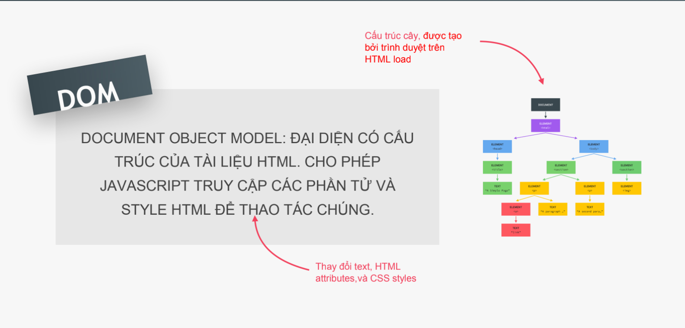
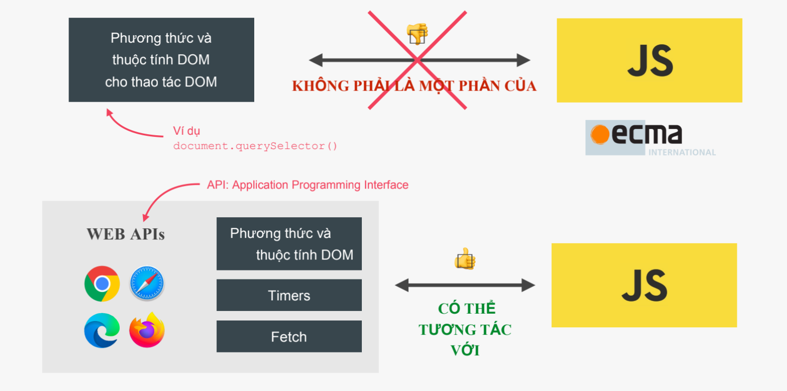

# Bài 7 - DOM and Event - Phần 1 (Cực quan trọng)

## I. Giới thiệu :

- Với lập trình web, kiến thức về DOM và khả năng thao tác DOM là hai yếu tố quan trọng nhất. DOM cho bạn khả năng thay đổi mọi thứ của trang web, khi mà mọi nội dung đều có thể được thêm bớt xóa sửa để mang lại trải nghiệm và nội dung tốt nhất.

- Và Javascript là một ngôn ngữ được sử dụng trên các Browser nên nó đóng một vai trò quan trọng trong các website. Javascript thao tác với tài liệu HTML kết hợp với phương thức của nó tạo nên các trải nghiệm thân thiện với người dùng trên web. Để thao tác được với các thẻ HTML thì Javascript phải thông qua một mô hình ta gọi là DOM.

==> Trong bài học này, chúng ta sẽ tìm hiểu về JS trong lập trình web:

- Giới thiệu về DOM
- Các thuộc tính và phương thức của DOM
- Áp dụng nguyên tắc dry vào lặp trình JS

## II. Demo một số ứng dụng nhỏ có dùng đến DOM

- Ứng dụng trò chơi đoán số
- Ứng dụng trò chơi tung xúc sắc

  ...

## III. DOM và DOM Manipulation (thao tác) là gì ?

### 1. Định nghĩa DOM

- DOM (viết tắc của Document Object Model) là 1 biễu diễn có cấu trúc (dạng cây) của tài liệu HTML

- DOM cho phép chúng ta sử dụng JS để truy cập vào các phần tử và style (CSS) để sử dụng chúng. Nói cách DOM giống như 1 điểm kết nối giữa tài liệu HTML và code JS của chúng ta.



- DOM được trình duyệt web tạo tự động ngay sau khi tải trang HTML về, và nó được lưu trữ dưới dạng cây DOM ??? Như thế nào ? Ok qua ví dụ sau mình sẽ giải thích chi tiết hơn

==> Tóm lại, DOM có các nhiệm vụ cơ bản sau :

- Cho phép truy cập đến các thẻ html
- Thay đổi các thuộc tín của thẻ html
- Thay đổi css của các thẻ html (style)
- Tạo, thêm, xóa các thẻ html

### 2. Cây cấu trúc DOM


code HTML :

```
<html>
  <head>
    <title>My title</title>
  </head>
  <body>
    <!-- commnet -->
    <a href="">My link</a>
    <h1>My header</h1>
  </body>
</html>


```

- Trong cây DOM, mỗi phần tử HTML là 1 object hay còn gọi là 1 node.

- Document là object đầu tiên ( hay còn gọi là root) của cây DOM, nó là điểm truy cập của cây DOM.

- Phần tử con tiếp theo thường là html và nó tieeos tục có 2 phần tử con là head và body (2 phần tử này là 2 phần tử liền kề, anh em).

- Đi tiếp xuống dưới ta sẽ thấy nhiều các phần tử html lồng nhau và chúng được biểu diễn trong cây DOM

- Cây DOM không chỉ có các node phần tử (element) mà còn có các node cho text, command, ... Tất cả những thứ có trong tài liệu HTML đều được biểu diễn trong DOM.

==> Lưu ý : về quan hệ giữa DOM với JS và trình duyệt web
DOM và các phương thức của phần tử DOM là 1 phần của WEB API (là các thư viện viết bằng JS mà trình duyệt triển khai mà chúng ta có thể truy cặp từ code JS) - chúng ta sẽ hiểu rõ về WEB API ở các bài sau.



### 3. Lựa chọn và thao tác các element

==> Để lựa chọn 1 element nào đó trong cây DOM ta có thể dùng các phương thức sau :

1. querySelector('điều kiện selector')
   Chọn ra 1 phần tử đầu tiên thỏa điều kiện selector đưa vào
   VD:

```
<!DOCTYPE html>
<html lang="en">
  <head>
    <meta charset="UTF-8" />
    <meta http-equiv="X-UA-Compatible" content="IE=edge" />
    <meta name="viewport" content="width=device-width, initial-scale=1.0" />
    <title>Document</title>
  </head>
  <body>
    <h1>Bài 5</h1>
    <p>Đoạn văn thứ 1</p>
    <p>Đoạn văn thứ 2</p>
    <div>
      <p>Đoạn văn thứ 3</p>
      <p>Đoạn văn thứ 4</p>
      <p class="note">Đoạn văn thứ 5</p>
    </div>

    <p class="note">Đoạn văn thứ 6</p>

    <p id="myId">Đoạn văn thứ 7</p>

    <script>
      "use strict";

      const pEl1 = document.querySelector("p");
      console.log(pEl1);
      pEl1.style.color = "red";

      const pEl3 = document.querySelector("div p");
      console.log(pEl3);
      pEl3.style.color = "blue";

      const pEl5 = document.querySelector(".note");
      pEl5.style.color = "green";
      console.log(pEl5);

      const pEl7 = document.querySelector("#myId");
      pEl7.style.color = "#aaa";
      console.log(pEl7);
    </script>
  </body>
</html>


```

2. querySelectorAll('điều kiện selector')
   Chọn tất cả các phần tử thỏa điều kiện slector đưa vào

```
<!DOCTYPE html>
<html lang="en">
  <head>
    <meta charset="UTF-8" />
    <meta http-equiv="X-UA-Compatible" content="IE=edge" />
    <meta name="viewport" content="width=device-width, initial-scale=1.0" />
    <title>Document</title>
  </head>
  <body>
    <h1>Bài 5</h1>
    <p>Đoạn văn thứ 1</p>
    <p>Đoạn văn thứ 2</p>
    <div>
      <p>Đoạn văn thứ 3</p>
      <p>Đoạn văn thứ 4</p>
      <p class="note">Đoạn văn thứ 5</p>
    </div>

    <p class="note">Đoạn văn thứ 6</p>

    <p id="myId">Đoạn văn thứ 7</p>

    <script>
      "use strict";

      // sẽ trả về 1 NodeList (danh sách các node - các element)
      const pElList = document.querySelectorAll("p");
      console.log(pElList);

      for (let i = 0; i < pElList.length; i++) {
        console.log(pElList[i].textContent);
      }
    </script>
  </body>
</html>

```

3. getElementById('tên của id')
   Chọn phần tử có id nào đó được đưa vào

VD:

```
<!DOCTYPE html>
<html lang="en">
  <head>
    <meta charset="UTF-8" />
    <meta http-equiv="X-UA-Compatible" content="IE=edge" />
    <meta name="viewport" content="width=device-width, initial-scale=1.0" />
    <title>Document</title>
  </head>
  <body>
    <h1>Bài 5</h1>
    <p>Đoạn văn thứ 1</p>
    <p>Đoạn văn thứ 2</p>
    <div>
      <p>Đoạn văn thứ 3</p>
      <p>Đoạn văn thứ 4</p>
      <p class="note">Đoạn văn thứ 5</p>
    </div>

    <p class="note">Đoạn văn thứ 6</p>

    <p id="myId">Đoạn văn thứ 7</p>

    <script>
      "use strict";

      const pEl = document.getElementById("myId");
      console.log(pEl);
      console.log(pEl.innerHTML);
    </script>
  </body>
</html>

```

4. getElementsByClassName('tên class')

   Chọn tất cả các phần tử có class đưa vào

VD:

```
<!DOCTYPE html>
<html lang="en">
  <head>
    <meta charset="UTF-8" />
    <meta http-equiv="X-UA-Compatible" content="IE=edge" />
    <meta name="viewport" content="width=device-width, initial-scale=1.0" />
    <title>Document</title>
  </head>
  <body>
    <h1>Bài 5</h1>
    <p>Đoạn văn thứ 1</p>
    <p>Đoạn văn thứ 2</p>
    <div>
      <p>Đoạn văn thứ 3</p>
      <p>Đoạn văn thứ 4</p>
      <p class="note">Đoạn văn thứ 5</p>
    </div>

    <p class="note">Đoạn văn thứ 6</p>

    <p id="myId">Đoạn văn thứ 7</p>

    <script>
      "use strict";

      // sẽ trả về 1 HTMLCollection - bộ sưu tập các phần tử
      const pEls = document.getElementsByClassName("note");
      console.log(pEls);

      for (let i = 0; i < pEls.length; i++) {
        console.log(pEls[i]);
        console.log(pEls[i].innerHTML);
      }
    </script>
  </body>
</html>

```

5. getElementsByTagName('đưa vào tên của thẻ')

   Chọn tất cả các phần tử có tên thẻ trùng với tên thẻ đưa vào

6. getElementsByName('đưa vào name của thẻ')

   Chọn tất cả các phần tử có attribute 'name' với tên được đưa vào

==> Một số các thuộc tính cần nắm

1. innerHTML
2. textContent
3. value

VD:

```
<!DOCTYPE html>
<html lang="en">
  <head>
    <meta charset="UTF-8" />
    <meta http-equiv="X-UA-Compatible" content="IE=edge" />
    <meta name="viewport" content="width=device-width, initial-scale=1.0" />
    <title>Document</title>
  </head>
  <body>
    <h1>Bài 7<i>(Quan trọng)</i></h1>
    <label for="name-input">Nhập tên của bạn :</label>
    <input type="text" id="name-input" placeholder="Nhập tên của bạn vào đây" />
    <button>Click</button>
    <script>
      const h1El = document.querySelector("h1");
      console.log(h1El.innerHTML);
      console.log(h1El.textContent);

      const inputEl = document.querySelector("input");

      document.querySelector("button").onclick = function () {
        console.log(inputEl.value);
      };
    </script>
  </body>
</html>


```

### 4. Thao tác với CSS Style

Thông qua DOM, chúng ta cũng có thể code CSS style cho các phần tử HTML mà chúng ta muốn

Một số phương thức dùng để chỉnh CSS

- .style.color
- .style.backgroundColor
- .style.display

==> Dạng .style.[tên property CSS viết theo dạng campCase ]

VD:

```
document.body.style.backgroundColor = '#123456';
```

==> Lưu ý là thuộc tính CSS được thêm bằng JS sẽ thêm vào phần tử dạng inlne style (áp dụng trực tiếp cho phần tử) --> có độ ưu tiên cao thứ 2 chỉ sau cách sử dụng !importance

### 5. Xử lý sự kiện click (click Events)

==> Khái niệm về Event và EventListener

- Event là những sự kiện xảy ra trên trang như click chuột, di chuột, bấm phím,...
- EventListener là việc lắng nghe sự kiện xảy ra và phản hồi nó , VD: sau khi nguowicf dùng click chuột vào phím xóa thú thú cưng thì tiến hành xóa thú cưng đó và thông báo đã xóa thành công chẳn hạn !

==> Có 2 cách chính để bắt và xử lý sự kiện :

<b>1. Cách 1 : DOM Events </b>

<b>1.1 Thêm Attribute events vào chính thẻ HTML</b>

VD:

```
<!DOCTYPE html>
<html lang="en">
  <head>
    <meta charset="UTF-8" />
    <meta http-equiv="X-UA-Compatible" content="IE=edge" />
    <meta name="viewport" content="width=device-width, initial-scale=1.0" />
    <title>Document</title>
  </head>
  <body>
    <button id="btn" onclick="showHello()">Click here !!!</button>

    <script>
      "use strict";

      function showHello() {
        alert("Xin chào mọi người , tôi là HTN !");
      }
    </script>
  </body>
</html>

```

VD2: sự kiện xóa thú cưng
code HTML

```
<!DOCTYPE html>
<html lang="en">
  <head>
    <meta charset="UTF-8" />
    <meta http-equiv="X-UA-Compatible" content="IE=edge" />
    <meta name="viewport" content="width=device-width, initial-scale=1.0" />
    <title>Document</title>
  </head>
  <body>
    <table>
      <tr>
        <th>Id</th>
        <th>Name</th>
        <th>Age</th>
        <th>Type</th>
      </tr>

      <tbody id="tbody"></tbody>
    </table>

    <script src="script.js"></script>
  </body>
</html>

```

Code js

```
("use strict");

const pet1 = {
  id: "P001",
  name: "Lucky",
  age: 3,
  type: "Dog",
};

const pet2 = {
  id: "P002",
  name: "Bông",
  age: 2,
  type: "Cat",
};

const pet3 = {
  id: "P003",
  name: "Đen",
  age: 4,
  type: "Dog",
};

const pet4 = {
  id: "P004",
  name: "Hoàng thượng",
  age: 3,
  type: "Cat",
};

const petArr = [pet1, pet2, pet3, pet4];
const tbodyEl = document.getElementById("tbody");
const tableData = function (arr) {
  tbodyEl.innerHTML = "";
  let html = "";
  for (let i = 0; i < arr.length; i++) {
    html += `
	 	<tr>
		 <td>${arr[i].id}</td>
		 <td>${arr[i].name}</td>
		 <td>${arr[i].age}</td>
		 <td>${arr[i].type}</td>
		 <td><button onclick = "deletePet(this)">Delete</button></td>
		</tr>
	  `;
  }

  tbodyEl.innerHTML = html;
};

tableData(petArr);

const deletePet = function (r) {
  id = r.parentElement.parentElement.children[0].innerHTML;
  for (let i = 0; i < petArr.length; i++) {
    if (petArr[i].id === id) {
      petArr.splice(i, 1);
      break;
    }
  }
  tableData(petArr);
};

```

<b>1.2 Sử dụng element node để gọi đến attribute events và gán giá trị cho nó </b>

VD:

```
<!DOCTYPE html>
<html lang="en">
  <head>
    <meta charset="UTF-8" />
    <meta http-equiv="X-UA-Compatible" content="IE=edge" />
    <meta name="viewport" content="width=device-width, initial-scale=1.0" />
    <title>Document</title>
  </head>
  <body>
    <button id="btn">Click here !!!</button>

    <script>
      "use strict";

      const btnEl = document.getElementById("btn");

      btnEl.onclick = function () {
        alert("Xin chào mọi người , tôi là HTN !");
      };
    </script>
  </body>
</html>

```

<b>2. Sử dụng phương thức addEventListener(): </b>

==> Phương thức này nhận vào 2 tham số :

- Thứ nhất là tên sự kiện ,vd :'click','load',...
- Thứ hai là nhận vào 1 hàm xử lý sự kiện (event handler function) (sẽ tìm hiểu rõ dạng hàm này ở các bài sau )

VD :

```
("use strict");

const pet1 = {
  id: "P001",
  name: "Lucky",
  age: 3,
  type: "Dog",
};

const pet2 = {
  id: "P002",
  name: "Bông",
  age: 2,
  type: "Cat",
};

const pet3 = {
  id: "P003",
  name: "Đen",
  age: 4,
  type: "Dog",
};

const pet4 = {
  id: "P004",
  name: "Hoàng thượng",
  age: 3,
  type: "Cat",
};

const petArr = [pet1, pet2, pet3, pet4];
const tbodyEl = document.getElementById("tbody");
const tableData = function (arr) {
  tbodyEl.innerHTML = "";
  let html = "";
  for (let i = 0; i < arr.length; i++) {
    html += `
	 	<tr>
		 <td>${arr[i].id}</td>
		 <td>${arr[i].name}</td>
		 <td>${arr[i].age}</td>
		 <td>${arr[i].type}</td>
		 <td><button>Delete</button></td>
		</tr>
	  `;
  }

  tbodyEl.innerHTML = html;

  const deleteEls = document.querySelectorAll("button");

  for (let i = 0; i < deleteEls.length; i++) {
    deleteEls[i].addEventListener("click", function () {
      const id = deleteEls[i].parentElement.parentElement.children[0].innerHTML;
      deletePet(id);
    });
  }


};

tableData(petArr);

function deletePet(id) {
  for (let i = 0; i < petArr.length; i++) {
    if (petArr[i].id === id) {
      petArr.splice(i, 1);
      break;
    }
  }
  tableData(petArr);
}

```

VD2 : Một cách khác nữa để xóa thú cưng

```
("use strict");

const pet1 = {
  id: "P001",
  name: "Lucky",
  age: 3,
  type: "Dog",
};

const pet2 = {
  id: "P002",
  name: "Bông",
  age: 2,
  type: "Cat",
};

const pet3 = {
  id: "P003",
  name: "Đen",
  age: 4,
  type: "Dog",
};

const pet4 = {
  id: "P004",
  name: "Hoàng thượng",
  age: 3,
  type: "Cat",
};

const petArr = [pet1, pet2, pet3, pet4];
const tbodyEl = document.getElementById("tbody");

const tableData = function (arr) {
  tbodyEl.innerHTML = "";
  let html = "";
  for (let i = 0; i < arr.length; i++) {
    html += `
	 	<tr>
		 <td>${arr[i].id}</td>
		 <td>${arr[i].name}</td>
		 <td>${arr[i].age}</td>
		 <td>${arr[i].type}</td>
		 <td><button class = "btn-delete">Delete</button></td>
		</tr>
	  `;
  }

  tbodyEl.innerHTML = html;
};

tableData(petArr);

tbodyEl.addEventListener("click", function (e) {
  if (e.target.className !== "btn-delete") return;

  const isDelete = confirm("Bạn có chắc chắn muốn xóa hay không ?");

  if (isDelete) {
    const id = e.target.parentElement.parentElement.children[0].innerHTML;
    deletePet(id);
  }
});

function deletePet(id) {
  for (let i = 0; i < petArr.length; i++) {
    if (petArr[i].id === id) {
      petArr.splice(i, 1);
      break;
    }
  }
  tableData(petArr);
}

```

## IV. Áp dụng nguyên tác Dry

- Kỹ thuật refactoring (tối ưu lại code) là kỹ thuật tối ưu code loại bỏ các code trùng lặp

- Kỹ thuật refactoring tuân thủ nguyên tắc Dry là Dont Reepeat Code - Không lặp lại code

==> Để tối ưu code : ta xác định các đoạn code có cấu trúc đặc điểm giống nhau hoặc gần giống nhau, sau đó thiết lặp các hàm để tránh trùng lặp code

==> Tại sao chúng ta cần refector code , vì sẽ giúp chúng ta code ngắn gọn, dể sữa đổi, nâng cấp sau này cũng như có cái nhìn khái quát tổng quan dể hiểu code hơn, mang tính module hóa hơn

## V. Tổng kết

==> Bài này là 1 bài rất quan trọng, chúng ta cần phải thực hiện code và thực hành qua các thao tác DOM nhiều lần để nhớ và làm quen với DOM tốt hơn

Trong bài này, chúng ta cần phải nắm chắc các kiến thức sau :

- Nắm được DOM là gì ? Cấu trúc cây DOM như thế nào?
- Vai trò của DOM, mối quan hệ giữa DOM với JS và trình duyệt web
- Hiểu và thực hành được một số các thuộc tính , phương thức DOM cơ bản và thông dụng
- Sử dụng được DOM để tinh chỉnh HTML, CSS cho trang tài liệu HTML
- Nắm bắt được cách lắng nghe và xử lý sự kiện xảy ra trên các phần tử của cây DOM (tức các element của trang HTML)
- Áp dụng được nguyên tắc Dry vào quá trình refactor code của chúng ta
  --> Tìm hiểu project game đoán số (Phần này cũng chính là bài Lab 7 của chúng ta nên mình để dành sang bài Lab 7 chuẩn bị tới đây để mình trình bày cụ thể hơn - nên mới chưa nói trong bài này vội !)
