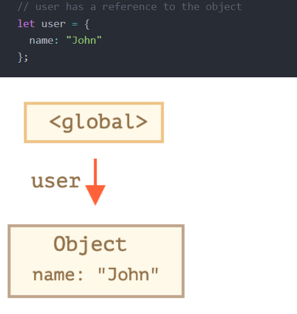
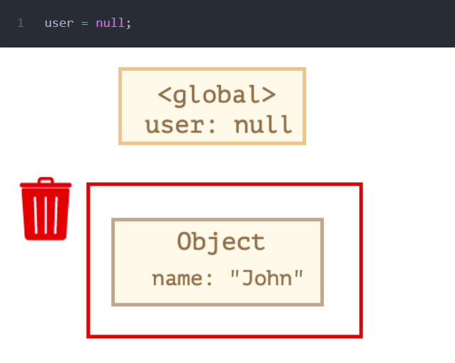
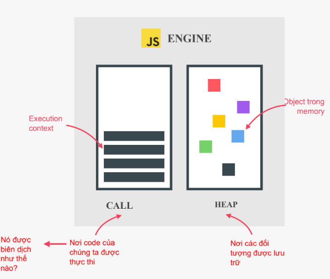
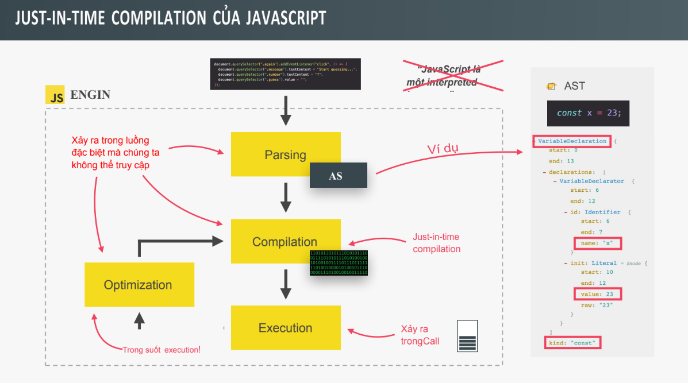

# Bài 9 - Cách thức JS thực thi chương trình - Phần 1

## I. Giới thiệu

Trong bài học nỳ, chúng ta sẽ xem xét "hậu trường" của JS và tìm hiểu cách thức hoạt động của ngôn ngữ JS. Chúng ta sẽ nâng tầm các kiến thức cơ bản về JS lên một cấp độ hoàn toàn mới, chúng ta sẽ hiểu chính xác mọi thứ diễn ra như thế nào trước khi thực sự triển khai chương trình. OK ! Cùng thắc dây an toàn và lên chiến bay khám phá những điều diệu kỳ của JS nào ! Let's go !

## II. Tổng quan NÂNG CAO về JavaScript

(Khá là trừu tượng và lý thuyết nhưng chúng ta cũng cần phải nắm chắc - theo cách hiểu và diễn đặt được chứ không cần rập khuôn hay thuộc lòng đâu nhé !)

==> JavaScript là ngôn ngữ laaph trình bậc cao, hướng đối tượng, đa mô hình, có cơ chế quản lý bộ nhớ, được thông dịch hoặc biên dịch JIT, có tính động, đơn luồng, có các hàm first-class và mô hình đồng thờ non blocking event loop.

==> Tóm lại là JS có 8 đặc định sau, chúng ta sẽ đi chi tiết vào 8 đặc điểm đó ngay sau đây :

### 1. JS là ngôn ngữ lập trình bậc cao (High Level)

- Mọi chương trình chạy trên máy tính đều cần một số tài nguyên phần cứng, chẳng hạn như bộ nhớ và CPU. Các ngôn ngữ cấp thấp, chẳng hạn như C thì chũng ta phải yêu cầu máy tính cung cấp bộ nhớ để tạo một biến mới. Mặt khác , các ngôn ngữ cấp cao như JS, Python, chúng ta không phải quản lý tài nguyên vì những ngôn ngữ nanyf có các phần `trừu tượng` được gọi và loại bỏ tất cả các công việc đó khỏi chúng ta. Điều này làm cho ngôn ngữ bặc cao dể học và dễ sử dụng hơn, nhưng nhược điểm là các chương trình bậc cao sẽ không bao giờ nhanh như chương trình C (C rất nhanh nhé , thậm chí nếu chúng ta viết bằng ngôn ngữ Assembly thì càng nhanh hơn nữa :v)

### 2. Có cơ chế quản lý bộ nhớ (garbage collected)

- Cơ chế quản lý bộ nhớ là một THUẬT TOÁN bên trong công cụ JS tự động loại bỏ các đối tượng cũ, đối tượng lâu không sử dụng khỏi bộ nhớ máy tính. Nó giống như một công cụ dọn dẹp, dọn sạch bộ nhớ theo thời gian
  VD : đơn giản sau :

Ta có 1 đối tượng user như sau, biến user này sẽ tha chiếu đối đối tượng như hình



Sau đó, ta ghi đè (gán lại biến user bằng null) thì tham chiếu đến đối tượng ban đầu sẽ mất đi, lúc này, JS sẽ hiểu là đối tượng này không còn được sử dụng nữa nên nó sẽ dọn dẹp và xóa đối tượng này ra khỏi bộ nhớ !



### 3. Cơ chế thông dịch hoặc biên dịch Just In Time

- Cơ chế thông dịch hoặc biên dịch JIT (biên dịch trong khi chạy): Bộ xử lý của máy tính chỉ có thể hiểu 0 và 1. Vì vậy mọi chương trình cần được viết bằng 0, 1 hay còn gọi là mã máy (machine code). Với ngôn ngữ lập trình, cụ thể là Javascript, code được viết ra để con người có thể hiểu được nên nó là một sự trìu tượng hóa dựa trên mã máy. Tuy nhiên code Javascript vẫn phải được dịch sang mã máy để máy có thể hiểu được, quá trình này gọi là thông dịch hoặc biên dịch.

### 4. Ngôn ngữ đa mô hình (multi-paridigm)

Hiện nay có 3 mô hình lập trình phổ biến sau, và JS cũng có cả 3 loại mô hình này , đó là :

- Lập trình thủ tục - Procedural programing: Sắp xếp code một cách tuyến tính, từ trên xuống dưới

- Lập trình hướng đối tượng - Object oriented programing OOP

- Lập trình hướng hàm - Functional Programing

### 5. Ngôn ngữ hướng đối ượng dựa trên nguyên mẫu (prototype)

- Hầu hết mọi thứ trong JS đều là đối tượng ngoại trừ các giá trị nguyên thủy
- VD: mảng cũng là 1 đối tượng, nên chúng có các phương thức như push, pop,.. các phương thức này là do kế thừa theo prototype. Prototype giống như một template (mẫu), Array.prototype chứa tất cả các phương thức của mảng

### 6. Ngôn ngữ với các hàm first-class

- Các hàm first-class là các hàm được coi như là một biết thông thường, ta có thể truyền hàm vào hàm khác, trả về hàm từ các hàm, ... Nó là một tính năng mạnh mẽ để thực hiện các kỹ thuật phức tạp và được sử dụng trong paradirm lập trình hàm.

### 7. Ngôn ngữ có tính động

- Tính dynamic ở đây thực ra là dynamic-typed (cho phép thay đổi kiểu biến tùy biến), trong Javascript chúng ta không chỉ định được kiểu dữ liệu cho các biến, thay vào đó chúng chỉ được chỉ định khi JS thực thi code. Ngoài ra kiểu dữ kiệu cũng dễ dàng thay đổi khi chúng ta gán lại dữ liệu.

### 8. Ngôn ngữ ĐƠN LUỒNG và mô hình đồng thời event loop & non-blocking

- JS là ngôn ngữ lập trình đơn luồng, có nghĩa là chúng chỉ có thể làm từng việc một nên chúng cần có mô hình đồng thời .
- Mô hình đồng thời là cách mà công cụ JS xử lý nhiều tác vụ cùng một lúc
- Với đơn luồng, nếu một nhiệm vụ kéo dài nó sẽ chặn cả luồng đơn chạy , khi đó chúng ta cần trạng thái non-blocking (không dừng)

VD:

- Event loop thực hiện nhiều tác vụ lâu dài và thực thi nó ở background sau đó đưa chúng trở lại luồng chính sau khi chũng hoàn thành

==> Tóm lại JS là 1 mô hình đồng thời với non-blocking event loop với 1 luồng duy nhất

## II. JavaScript Engine và Runtime

### 1. Định nghĩa JS Engine

- JS engine là 1 chương trình máy tính thực thi code JS
- Mỗi trình duyệt hiện nay đều có JS Engine , công cụ được biết đến nhiều nhất là Google V8
- Ngoài ra, JS Engine còn được áp dụng để lập trình server với Node.js runtime system.


### 2. Cấu trúc của JS Engine



- Bất kỳ JS engine nào cũng chứa call stack và heap

- Call stack là nơi code được thực thi bằng cách sử dụng Execution Context (EC)- mình sẽ nói rõ chi tiết hơn về EC sau

- Heap là một vùng nhớ không có cấu trúc, lưu trữ tất cả các đối tượng (Object) mà ứng dụng cần

### 3. Phân biệt giữa thông dịch và biên dịch

- Trong quá trình biên dịch, toàn bộ code được chuyển đổi thành mã máy cũng một lúc, sau đó mã máy này được viết thành một file di động có thể thực thi trên bất kỳ máy tính nào

- Quá trình thông dịch chạy code và thực hiện từng dòng một, code được đọc và thực thi tất cả cùng một lúc. Code javascript vẫn được chuyển sang mã máy nhưng sau đó được thực thi luôn

==> `JS thì kết hợp cả thông dịch và biên dịch`

- JS đã từng là một ngôn ngữ thông dịch thuần túy nhưng vấn đề của trình thông dịch là chúng chậm hơn nhiều lần so với biên dịch, với web hiện đại ngày nay điều đó không được chấp nhận nữa. JS ngày nay kết hợp vừa thông dịch vừa biên dịch được gọi là Just In time compilation

- JIT compiler hiểu cơ bản là biên dịch toàn bộ code thành mã máy cùng một lúc sau đó thực thi nó ngay lập tức. Điều này khiến JS thực thi nhanh hơn so với thông dịch trước đây

==> `Cách hoạt động của trình biên dịch just-in-time`


1. Phân tích cú pháp (Pharsing): Khi một đoạn code JS đi vào JS Engine code sẽ được phân tích thành một cấu trúc dữ liệu được gọi là cây cú pháp trừu tượng (Abstract Syntax Tree), bước này cũng kiểm tra xem code có lỗi cú pháp nào không. Cây kết quả sẽ được sử dụng để tạo Mã máy

Lưu ý: Cây cú pháp trừu tượng không liên quan gì đến cây DOM

2. Biên dịch (Compilation) lấy AST được tạo ra và biên dịch nó thành mã máy

3. Thực thi mã máy (Execution), việc thực thi diễn ra trong Call Stack

Sau bước 3 JS Engine đã tạo một phiên bản đầu tiên, sau đó JS Engine thực hiện thêm một số chiến lược tối ưu hóa thực hiện trong background và biên dịch lại trong quá trình thực thi chương trình đã chạy.

### 4. JS Runtime

Về cơ bản nôm na, JS Runtime trong trình duyệt như một hộp, thùng chứa lớn chứa tất cả những thứ cần thiết để sử dụng JS, bao gồm:

- JS Engine
- WEB APIs
- Callback Queue


==> Trọng tâm nhất vẫn là JS Engine (chúng ta đã tìm hiểu ở trên)
==> Về WEB APIs

- JS Runtime bao gồm WEB APIs (các chứng năng được chung cấp cho engine), VD : DOM, Ajax, setTimeout,Fetch,...
- JS có quyền truy cập vào API này thông qua đối tượng window ? Là sao ?
  OK! để mình ví dụ :

VD:

```
// như đã nói hàm setTimeout là 1 API
// Thông thường ta truy cập API này bằng cách viết
// thế này đúng không ??
setTimeout(function () {
  console.log("In ra sao 2 giây !");
}, 2000);

// nhưng thật ra nó tương đương với cách viết thế này
// ==> do đó mới nói ta truy cập các API qua đối tượng window -->OK!
window.setTimeout(function () {
  console.log("In ra sao 2 giây !");
}, 2000);

```

==> Về Callback Queue (Queue gọi là hàng đợi)

- Callback Queue là cấu trúc dữ liệu có chứa tất cả các hàm callback sẳn sàng để thực thi
  (Hiểu nôm na là thế này, Callback queue sẽ nhận các callback function và xếp vào hàng đợi, sau đó quyết định function nào được chạy tiếp theo bằng nguyên tắc FIFO - First In First Out (vào trước ra trước)==> giống như cách chũng ta xếp hàng mua vé xem phim chẳng hạn ==> Còn về chi tiết tổng kết hoạt động cụ thể tất cả các thành phần trong JS Runtime hoạt động thế nào thì mình sẽ tổng kết lại sau, nhưng trước hết chũng ta cần biết chức năng của các phần khác nhau để hiểu nó hoạt động ra sao !!!!)

VD: Qua ví dụ sau mình sẽ giải thích kỹ hơn về Callback Queue

```
// như đã nói hàm setTimeout là 1 API
// Thông thường ta truy cập API này bằng cách viết
// thế này đúng không ??
setTimeout(function () {
  console.log("In ra sao 2 giây !");
}, 2000);

// nhưng thật ra nó tương đương với cách viết thế này
// ==> do đó mới nói ta truy cập các API qua đối tượng window -->OK!
window.setTimeout(function () {
  console.log("In ra sao 2 giây !");
}, 2000);

for (let i = 0; i <= 10; i++) {
  console.log("Ok " + i);
}

```

VD: Hàm được truyền vào để xử lý sự kiện trên 1 phần tử DOM cũng là một hàm callback, hay hàm được gọi lại để thực thi sau 1 khoảng thời gian nào đó dùng trong setTimeOut cũng là một callback function.

VD:

```
document.querySelector("h1").addEventListener("click", function () {
  this.style.backgroundColor = "red";
});

```

- Sau khi 1 event xảy ra, hàm callback được đặt vào callback queue, sau đó khi call stack rỗng, hàm callback được đặt vào stack để nó thực thi, quá trình này xảy ra theo cơ chế event loop ?? Vậy cơ chế Event Loop là gì? hoạt động ra sao ??

==> Cơ chế Event Loop

- Event Loop nhận các hàm callback từ Callback queue và đưa chúng vào call stack để thực thi . --> Đó là về chức năng của Event Loop về cơ bản là nó làm thế ? Nhưng cụ thể nó làm ra sao, dựa trên nguyên tắc gì để nó có thể quyết định callback nào sẽ được nó chọn để lấy đi thực thi ??

--> Ok ! Chi tiết hơn nó sẽ hoạt động ra sau : Phần sau chũng ta sẽ hiểu rõ hơn nhé !
Nó sẽ quan sát xem call stack trong JS engine có trống hay không (hiểu nôm na là có đang rãnh hay không ấy, nêu trống thì nó sẽ lấy callback ở đầu hàng đợi trong callback queue để đưa vào call stack để call stack thực thi cách dòng code trong callback function !! Vậy nếu call stack không rãnh thì sao --> thì nó chờ cho rãnh thôi !) Mình ví dụ cụ thể nhé !

VD:

```
document.querySelector("h1").addEventListener("click", function () {
  this.style.backgroundColor = "red";
});

let i = 0;
while (i < 100000) {
  console.log(i++);
}

```

## III. Execution Context và Call Stack

Phần này chúng ta sẽ học để hiểu rõ chi tiết về cách 1 chương trình JS (code của chúng ta) chạy ra sao, đặc biệt là call stack mình nói ở bên trên nó hoạt động thế nào nhé !

### 1. Quá trình thực thi chi tiết của 1 chương trình JS

Sau khi quá trình trình BIÊN DỊCH hoàn tất, mã máy được đưa vào quá trình thực thi , các bước tổng quát , cơ bản như sau (cũng như ví dụ mình nói bên trên thôi !)

1. Tạo ra global excecution context (EC) (ngữ cảnh thực thi toàn cục) - dành cho những code thuộc top-level (code thuộc top-level là những code không nằm trong bất kỳ function nào)

- Execute context là ngữ cảnh thực thi, định nghĩa là môi trường thực thi đoạn code JS, ===> nó giống như một chiếc hộp lưu giữ tất cả các thông tin cần thiết để code được thực thi , như là : các biến cục bộ hay các đối số truyền vào

VD:

```

```

- Code JS luôn chạy trong một EC
- Trong bất kỳ dự án JS nào cũng chỉ có duy nhất 1 global EC là context mặc định để thực thi các code thuộc top level

2. Sau khi tạo ra global EC, thì nó sẽ tiến hành thực thi code trong EC này, tức là thực thi các dòng code top level ấy !

3. Sau đó nếu gặp các hàm thì nó sẽ thực thi các hàm (lưu ý khi gặp 1 lời gọi hàm nó sẽ tạo ra 1 EC cục bộ cho hàm ấy và sau đó thực thi code trong hàm ấy), hoặc nó sẽ thực thi các đoạn code bất đồng bộ hay chờ thwucj thi các sự kiện (hay còn gọi là chờ callback đưa lên call stack thông qua event loop để call stack có thể thực thi các dòng code bên trong callback ấy)

- Lưu ý như trên: Khi 1 hàm được gọi sẽ có 1 EC được tạo ra (và lưu ý là sẽ khác nhau ở từng lần gọi nhá , cho dùng là gọi chung 1 hàm ! Sau này mình sẽ ví dụ và nói sâu hơn ở các bài sau !)
- Các EC này kết hợp với nhau tạo thành các call back ????

### 2. Tìm hiểu sâu hơn , bên trong ngữ cảnh thực thi (Execution Context)

Bên trong EC bao gồm :

1. Variable Environment chứa các biến, khai báo hàm và cũng có 1 đối tượng (object) argument đặc biệt (chứa tất cả các đối số được truyền vào hàm thuộc về EC hiện tại --> EC hiện tại ? Why ? --> ý muốn nói mỗi lần gọi khác nhau sẽ có môi trường biến khác nhau ấy --> do đó mà mình nói mỗi lần gọi hàm sẽ sinh ra những EC khác nhau đó !)

2. Scope Chain bao gồm các tham chiếu đến các biến nằm ngoài hàm hiện tại (chúng ta sẽ tìm hiểu nó sau !)

3. Từ khóa this (cũng sẽ tìm hiểu ở bài sau)

LƯU Ý : EC của hàm mũi tên sẽ không lấy được arguments và cũng không có this

VD: có thể hình dung thế này, trước khi thực thi 1 function , JS sẽ tạo ra 1 EC Object, để scan toàn bộ function đó và tạo ra các biến để lưu trữ thông tin môi trường thực thi code của chúng ta, trong đó có : Variable Environment (đại diển bởi đối tượng variableObject trong đoạn code dưới đây), Scope Chain và this

```
executionContextObj = {
    'scopeChain': { /* variableObject + all parent execution context's variableObject */ },
    'variableObject': { /* function arguments / parameters, inner variable and function declarations */ },
    'this': {}
}
```

==> `giải thích chi tiết hơn như sau :`

Khi JS gặp 1 đoạn code gọi hàm thì :

1. Trước khi thực thi đoạn code trong hàm ấy, nó sẽ tạo ra 1 `execution context`, EC này có gì :

- Khởi tạo Scope Chain
- Tạo VO(Variable Object)
- Scan toàn bộ tham số, biến, gán tên và giá trị cho chúng
- Scan context của các function tìm thấy trong đó, với mỗi function tìm thấy, tạo một key trong VO trùng với tên function, và trỏ vào function đó trong bộ nhớ(nếu bị trùng sẽ ghi đè)
- Scan context của các khai báo biến trong đó , tạo key trong VO
- Xác định giá trị của this

2. Sau đó sẽ thực thi code (chạy function) - tại call stack

VD:

```
function foo(i) {
    var a = 'hello';
    var b = function privateB() {

    };
    function c() {

    }
}

foo(22);
```

Khi hàm foo(22) được gọi thì sẽ tiến thành các bước sau:

bước 1: khởi tạo ra 1 EC object

```
fooExecutionContext = {
    scopeChain: { ... },
    variableObject: {
        arguments: {
            0: 22,
            length: 1
        },
        i: 22,
        c: pointer to function c()
        a: 'hello',
        b: pointer to function privateB()
    },
    this: { ... }
}
```

bước 2: code sẽ được thực thi

Ta thấy, hàm `c` được khai báo sau, nhưng nó luôn được đưa lên đầu --> chính là hoisting do đó mà ta có thể sử dụng hàm trước khi khai báo

==> `Call Stack vs EC ??`

- Call satck là nơi các EC xếp chồng lên nhau, EC ở trên cùng của stack là thứ hiện đang chạy (đang được thực thí code) và khi chạy xong nó sẽ bị xóa khỏi stack (tứ EC - ngữ cảnh thực thi sẽ bị xóa - và toàn bộ những gì bên trong EC cũng sẽ bị xóa đi 1 cách không thương tiết :v)

- Việc thực thi diễn ra theo nguyên lý của stack - LIFO - Last In First Out

VD: đoạn code sau sẽ thực thi ra sao ?

```
const second = () => {
  console.log("Hello there!");
};

const first = () => {
  console.log("Hi there!");
  second();
  console.log("The End");
};

first();

```

==> Giải thích


- Đầu tiên, khi ta chạy đoạn code trên, một EC toàn cục sẽ tạo ra (trong trường hợp này ta biểu diễn nó bằng hàm main() ) và nó sẽ được push (đẩy) vào ngăn xếp.
- Tiếp đến , code chạy đên dòng gọi hàm `first();` thì hàm first sẽ được thực thi (lúc này JS Engine sẽ tạo ra 1 EC cục bộ đại diện cho hàm first)
  (Một số lưu ý : 1. là hàm chỉ được thực thi khi ta gọi hàm mà thôi , 2. mỗi lần hàm được gọi thì thì sẽ sinh ra các EC KHÁC NHAU nhá !)

- Tiếp theo, `console.log("Hi there!");` được gọi (nhớ là nó cũng là 1 hàm cho nên khi gọi nó cũng sinh ra 1 EC), thì nó sẽ được push vào ngăn xếp, sau khi thực thi dòng này xong, tức là hàm này được thực thi xong (kết thúc) thì nó sẽ được pop (lấy ra) khỏi ngăn xếp .

- Sau đó đến dòng tiếp theo, hàm `second()` được gọi cũng tương tự nó sẽ tạo ra 1 Ec và được đẩy vào ngăn xếp , vào code bên trong hàm này sẽ được thực thi

- Ta xem hàm second: đầu tiên `console.log("Hello there!");` câu lệnh này sẽ được thực thi, nó là 1 hàm nên JS sẽ tạo 1 EC cục bộ cho nó và đẩy nó vào ngăn xếp, thwucj thi xong nó sẽ được lấy ra khỏi ngăn xếp. Và vì hàm này chỉ có 1 dòng code này nên thực thi xong dòng này cũng là kết thúc hàm second , do đó hàm second kết thúc thì nó cũng bị lấy ra khỏi ngăn xếp.

- Tiếp đến, `console.log("The End");` được thực thi, cũng tương tự nó được đẩy vào ngăn xếp để thực thi, sau khi thực thi xong nó sẽ bị lấy ra khỏi ngăn xếp. Và sau đó, hàm first của chúng ta cũng đã thực thi xong tất cả các câu lệnh nên kết thúc, lúc này nó cũng được lấy ra khỏi ngăn xếp

- Và cuối cùng , vì không còn câu lệnh nào nữa (chương trình thực thi xong) nên EC toàn cục (main) cũng sẽ bị xóa khỏi stack .

==> Mọi người đã có được cái nhìn tổng thể về call stack hoạt động thế nào chưa ?? Thử 1 vài ví dụ và tự phân tích chúng ta sẽ hiểu ngay thôi !

## IV. Scope và Scope Chain

### 1. Các khái niệm về scope

- Scoping kiểm soát cách JS Engine sắp xếp và truy cập các biến trong chương trình

- Lexical scoping là cách tổ chức và truy cập các biến hoàn toàn bị vị trí của các hàm và các khối trong code kiểm soát. Ví dụ một hàm được viết trong một hàm khác có quyền truy cập các biến của hàm cha. Scope bị ảnh hưởng bởi vị trí mà chúng ta đặc các hàm và khối code của mình.

- Scope là không gian hoặc môi trường khai báo một biến nhất định.

- Sope của một biến là toàn bộ khu vực code có thể truy cập vào biến đó.

### 2. Ba dạng scope trong JS

Trong JS có 3 loại scope : global scope, function scope và block scope:

- Global Scope là các top-level code, các biến được khai báo bên ngoài bất kỳ hàm hoặc khối nào. Các biến này có thể được truy cập ở mọi nơi trong chương trình.

- Function Scope: mỗi một hàm đều tạo một scope và các biến khai báo bên trong phạm vi của hàm đó chỉ có thể được truy cập bên trong hàm. Đây còn được gọi là local scope.

- Block Scope: Từ ES6, các khối block cũng tạo ra một scope, code block tất cả mọi thứ nằm trong dấu ngoặc nhọn {} (ví dụ: khối lệnh if, vòng lặp for). Giống function scope, tất cả các biến được khai báo trong block chỉ có thể được truy cập bên trong block đó, không thế truy cập từ bên ngoài.

==> `Lưu ý` :

- Có 1 khác biệt nhỏ giữa function scope và block scope là block scope chỉ áp dụng cho các biến được khai báo bằng let, const và var là function scope.

- Ngoài ra, tất cả các scope đều có quyền truy cập vào các biến từ các scope bên ngoài của chúng.

VD:

```
const a = 10;

function func1() {
  var b = 20;
  console.log("func1 : " + (a + b));
  function func2() {
    console.log("func2 : " + a);
  }

  func2();
}

func1();

// console.log(b);
// func2();

```

### 3. Scope chain

- Nếu scope cần sử dụng một biến nào đó mà không tìm thấy trong scope hiện tại nó sẽ tra cứu trong scope chain để tìm xem liệu có tìm thấy biến đó từ một trong các parent scope không. Nếu có biến đó sẽ được sử dụng, nếu không tìm thấy nó sẽ báo lỗi. Quá trình này gọi là Tra cứu biến.

VD:

```
function myFunc(num) {
  const res = num * num;
  console.log(message);
  console.log(res);

  function display() {
    const message = `Kết quả bình phương của ${num} là : `;
    console.log(message + res);
  }

  display();
}

let message = "Hàm này sẽ tiến hành tính bình phương của 1 số";
myFunc(10);

```

### 4. Mối liên hệ giữa CallStack ,EC , variable enviroment và scope

- Call stack chứa các execution context, mỗi execution context đại điện cho mỗi hàm đúng theo thứ tự mà chúng được gọi.

- Execution context bao gồm môi trường biến.

- Các biến có sẵn trong Global Scope chính xác là các biến được lưu trữ trong môi trường biến của Global Execution Context.

- Các biến có trong các function scope cũng là các biến được lưu trữ trong môi trường biến của Excecution Context của từng hàm.

- Scope chain đóng vai trò để các function scope có quyền truy cập vào các parent scope của nó.

- Scope chain không liên quan đến thứ tụ hàm được gọi nó chỉ liên quan đến vị trí của hàm trong code.

- Nói cách khác scope chain không liên quan gì đến thứ tự của execution context trong call stack.

- Scope chain của một scope tương đương với việc cộng tất cả các môi trường biến của tất cả các parent scope lại với nhau.

==> `TÓM LẠI CẦN NHỚ :`

1. Scope là gì ? Scope cơ bản làm phạm vi hoạt động của biến, chúng tồn tại ở đâu, ở đâu có thể truy cập được chúng.
2. Có 3 loại scope trong JS: global scope, function scope, block scope : trong đó khai báo bằng let, const thì thuộc blcok scope , còn function scope thì áp dụng cho cả let const và var
3. Mỗi scope luôn có quyền truy cập vào tất cả các biến từ tất cả các scope bên ngoài - hay còn gọi là scope chain. Nhưng lưu lý là các scope bên ngoài không thể truy cập (không thể nhìn thấy các biến thuộc scope bên trong)
4. Khi truy cập 1 biến ở 1 scope bên trong , JS engine sẽ tiến hành tra cứu trong scope chain theo thứ tự từ trong ra ngoài (ưu tiên bên trong trước)
5. Scope chain tương đương với việc cộng tất cả môi trường biến của tất cả các parent scope và môi trường biến của chính nó
6. Scope chain không liên quan gì đến thứu tự các hàm được gọi, nó chỉ liên quan mật thiết đến thứ tự code mà chúng ta viết
7. EC thì lại liên quan mật thiết đến thứ tự mà các hàm được gọi

## V. Tổng kết

Trong bài học này, chúng ta đã học được các kiến thức sau:

- Làm rõ khái niệm và các đặc điểm nổi bật của ngôn ngữ Javascript
- Phân biệt thông dịch và biên dịch
- Khái niệm JS Runtime, JS Engine, Call Stack, Event loop, - Execution Context để hiểu cách thực thi của một chương trình Javascript.
- Thứ tự sắp xếp và cách thứcthực thi các block thông qua scope và scope chain. (cần nắm chắc)
- Định nghĩa về scope, các dạng scope và các vấn đề về scope trong code. (cần nắm chắc)
