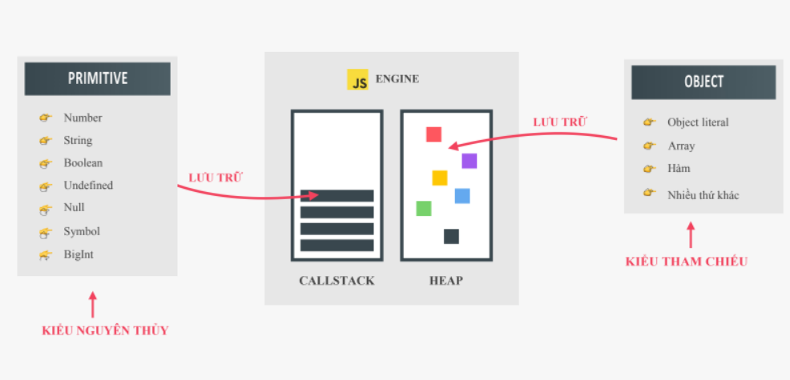
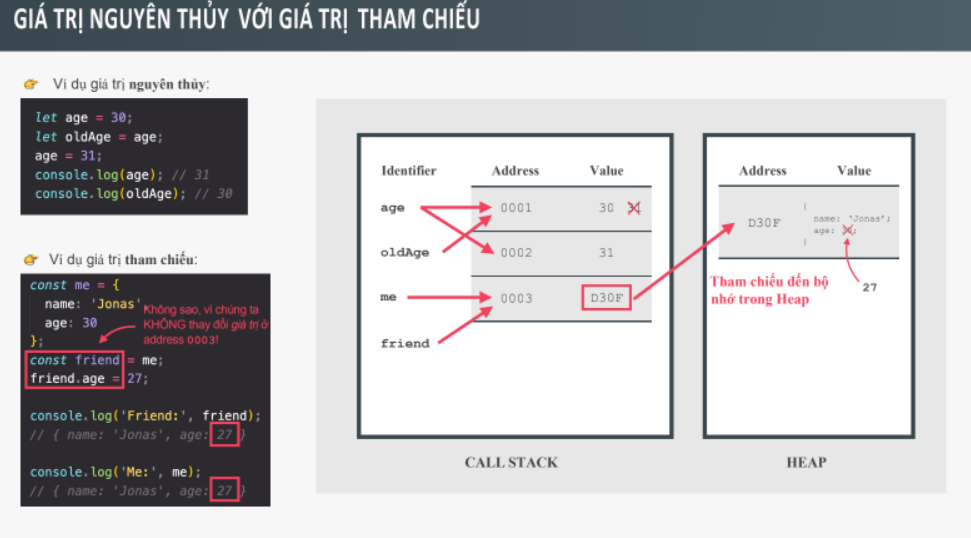

# Bài 10 - Cách thức JS thực thi chương trình - Phần 2

## I. Giới thiệu

Tiếp theo bài 9, trong bài học này chúng ta sẽ tìm hiểu 2 vấn đề rất dễ gây nhầm lẫn trong quá trình viết code:

- Giá trị của từ khóa this khi đặt trong các trường hợp khác nhau
- Cách lưu trữ của biến nguyên thủy và object và cách sử dụng trong thực tế

## II. Từ khóa `this`

### 1. Định nghĩa `this`

- Biến this là một biến đặc biệt được tạo trong mọi ngữ cảnh thực thi (Execution Context) và cho mọi function nào.
  --> `this` đại diện cho 1 đối tượng (Object). Đối tượng đó là chủ sở hữu của ngữ cảnh (hay nói cơ bản hơn là chủ của code đang được chạy)

- This trỏ tới giá trị của `chủ sở hữu` của hàm nơi mà this được gọi.

- This không phải static (tĩnh), nó phụ thuộc vào cách mà hàm được gọi - giá trị của this `chỉ được gán khi hàm thực sự được gọi`. (sẽ có ví dụ ở phía sau để chứng minh điều này)

### 2. Cách sử dụng `this` trong các hàm

<b>Có 4 cách :</b>

1. Hàm là một phương thức của một đối tượng: Khi gọi this thì giá trị của this sẽ trỏ đến đối tượng gọi phương thức

VD:

```
const HTN = {
  name: "Hồ Tấn Nhựt",
  age: 24,

  getInfo: function () {
    console.log(this);
    console.log(`Tôi tên là : ${this.name}, năm nay tôi ${this.age} `);
  },
};

HTN.getInfo();

```

2. Hàm là một function bình thường, không gắn với một object, khi gọi this sẽ trả về undefined đối với strict-mode. Nếu không đặt trong chế độ strict-mode, this sẽ trả về global object trong trình duyệt là đối tượng window.

```
"use strict";

function myFunc() {
  console.log(this);
}

myFunc();

```

3. Hàm là một arrow function (lexical this). Biến this sẽ có giá trị là giá trị của `hàm bao bên ngoài nó`, hàm parent.
   ==> Giải thích thêm : vì sao? Ta nhớ là hàm mũi tên không có từ khóa this , do đó khi dùng this bên trong hàm mũi tên nó chỉ đơn giản là tìm ra bên ngoài để lấy giá trị this(biến this) từ các phạm vi bên ngoài . Do đó nó sẽ có giá trị của hàm parent (hàm bao nó, gần nhất)

VD:

```
"use strict";

const test = () => console.log(this);

test();

function myFunc() {
  const foo = () => console.log(this);
  foo();
}

myFunc();

const HTN = {
  name: "Hồ Tấn Nhựt",
  age: 24,

  getInfo: function () {
    console.log("this của hàm bên ngoài ", this);

    const display = () => {
      console.log("hàm mũi tên ", this);
      console.log(`Tôi tên là : ${this.name}, năm nay tôi ${this.age} `);
    };

    display();
  },
};

HTN.getInfo();

```

4. Hàm là một Event Listener, từ khóa this sẽ LUÔN LUÔN trỏ đến phần tử DOM mà hàm xử lý được gắn vào.

```
const HTN = {
  name: "Hồ Tấn Nhựt",
  age: 24,

  getInfo: function () {
    console.log(this);
    console.log(`Tôi tên là : ${this.name}, năm nay tôi ${this.age} `);
  },
};

const h1El = document.querySelector("h1");
// h1El.addEventListener("click", function () {
//   console.log(this);
// });

// h1El.addEventListener("click", () => {
//   console.log(this);
// });

// h1El.onclick = function () {
//   console.log(this);
// };

// h1El.onclick = () => console.log(this);

```

Ngoài ra, this còn có những cách sử dụng khác khi kết hợp call , new, apply, bind,.. (sẽ được trình bày ở các phần sau)

==> `Tóm lại : `Cần lưu ý là `this` không phải trỏ đến hàm của chúng ta, mà nó trỏ đến `chủ sở hữu của hàm`, nên để xác định this sẽ là gì, thì cần xác định chủ sở hữu của hàm khi hàm `được gọi` .
==> Thứ 2 là, trong hàm mũi tên, sẽ không có this, (cũng giống như 1 biến nào đó không có trong scope của hàm, thì khi truy cập đến biến đó, nó sẽ tìm trong scope chain (chuỗi phạm vi) của mình để tìm đến biến đó có ở bên ngoài không, nếu có thì nó dùng biến đó --> thì trong trường hợp này cũng vậy, hàm mũi tên không có từ khóa this của riêng nó, do đó nó sẽ tìm ra bên ngoài để lấy giá trị this của hàm chứa nó gần nhất hoặc của đối tượng window).

VD: 1 ứng dụng đơn giản của hàm mũi tên

```
const HTN = {
	name: "Hồ Tấn Nhựt",
	age: 24,

	getInfo: function () {
	  console.log("this của hàm bên ngoài ", this);

	  // muốn viết 1 hàm bên trong 1 phương thức và có
	  //  sử dụng đến this, thì ta sẽ dùng hàm mũi tên
	  // vì hàm mũi tên sẽ không có từ khóa this, do đó nó
	  // lấy giá trị this của hàm cha bên ngoài
	  // mà giá trị this của hàm cha này là : trỏ đến đối tượng
	  // gọi phương thức getInfo
	  const display = () => {
		console.log("hàm mũi tên ", this);
		console.log(`Tôi tên là : ${this.name}, năm nay tôi ${this.age} `);
	  };

	  display();
	},
  };

  HTN.getInfo();
```

VD: 1 ví dụ nữa để chưng minh việc this không phải static (tĩnh), mà chỉ được xác định lúc được gọi (thực thi)

```
"use strict";

const HTN = {
  name: "Hồ Tấn Nhựt",
  age: 24,

  getInfo: function () {
    console.log(this);
    console.log(`Tôi tên là : ${this.name}, năm nay tôi ${this.age} `);
  },
};

HTN.getInfo();

const func = HTN.getInfo;

console.log(func);

func();

```

### 3. So sánh hàm thông thường và hàm mũi tên

`Nhắc lại về this trong hàm mũi tên :`

- Biến this trong hàm mũi tên không trỏ đến đối tượng gọi nó mà nhận những giá trị từ hàm bao ngoài.

- This trong global object luôn là window object

`Lưu ý khi khai báo biến với var`

VD:

```
var name = "Nguyễn Văn A";
var age = 30;

const HTN = {
  name: "Hồ Tấn Nhựt",
  age: 24,

  getInfo: function () {
    console.log(this);
    console.log(`Tôi tên là : ${this.name}, năm nay tôi ${this.age} `);
  },
};

HTN.getInfo();

const func = HTN.getInfo;

console.log(func);

func();

```

==> Các biến được khai báo var sẽ tạo ra các thuộc tính trên global object. Do đó, cần lưu ý để tránh sai soát.

==> Lưu ý : Không sử dụng hàm mũi tên để khai báo phương thức (chỉ sử dụng hàm thông thường) - nhất là với trường hợp bên trong phương thức có dùng đến this --> để tránh sai soát và dể kiểm soát từ khóa this của chúng ta hơn

VD:

```
var name = "Nguyễn Văn A";
var age = 30;

const HTN = {
  name: "Hồ Tấn Nhựt",
  age: 24,

  getInfo: () => {
    console.log(this);
    console.log(`Tên của thôi là ${this.name}, năm nay tôi ${this.age}`);
  },
};

HTN.getInfo();

```

`Trường hợp có hàm bên trong 1 phương thức :`

- Lưu ý trường hợp có hàm bên trong 1 phương thức của 1 đối tượng thì

1. Nếu hàm đó là hàm thông thường : thì nhớ là this của hàm này sẽ là 1 giá trị this riêng của nó, chứ không phải this của phương thức, dó đó, nó sẽ có giá trị là undefine (nếu ở trong chế độ stric mode) hoặc là đối tượng golobal window nếu ở chế độ bình thường

VD:

```
// "use strict";

var name = "Nguyên Văn A";
var age = 30;

const HTN = {
  name: "Hồ Tấn Nhựt",
  age: 24,

  getInfo: function () {
    console.log(this);
    function display() {
      console.log(this);
      console.log(`Tôi tên là : ${this.name}, năm nay tôi ${this.age} `);
    }

    display();
  },
};

HTN.getInfo();

```

2. Nếu là hàm mũi tên, thì hàm mũi tên không có this, nên nếu truy cập đến this thì this lúc này sẽ là this của hàm chứa nó gần nhất, tức là của phương thức (mà của phương thức thì this sẽ trỏ đến đối tượng gọi phương thức)

==> `Do đó`, nếu có 1 hàm bên trong phương thức mà cần sử dụng this của phương thức thì có 2 cách sau :

1. Tạo 1 biến `const self = this ` và sử dụng biến self này như là this của phương thức
2. Sử dụng hàm mũi tên

VD:

```
// "use strict";

var name = "Nguyên Văn A";
var age = 30;

const HTN = {
  name: "Hồ Tấn Nhựt",
  age: 24,

  getInfo: function () {
    console.log(this);
    const self = this;
    function display() {
      console.log(self);
      console.log(`Tôi tên là : ${self.name}, năm nay tôi ${self.age} `);
    }

    display();

    const display2 = () => {
      console.log(this);
      console.log(`Tôi tên là : ${this.name}, năm nay tôi ${this.age} `);
    };

    display2();
  },
};

HTN.getInfo();

```

`Từ khóa arguments (đối số)`

- Từ khóa arguments chỉ có sẵn trong cách hàm thông thường, không có trong hàm mũi tên.

- Nó là một mảng trỏ đến các đối số truyền vào hàm.

- Có thể truyền nhiều tham số hơn số lượng các tham số được đặt tên, tất cả các đối số đều được hiển thị trong mảng arguments.

VD:

```
function myFunc() {
  console.log(arguments);
}

myFunc("OK1", "Ok2", 10, 20, 30);

const getSum = function () {
  if (arguments.length === 0) {
    console.log("Không có tham số nào !");
  } else {
    let total = 0;
    for (let i = 0; i < arguments.length; i++) {
      total += arguments[i];
    }

    console.log(`Tổng của các số là : ${total}`);
  }
};

getSum(10, 20, 30, 40, 50);
getSum(10, 20, 30, 40, 50, 60, 70, 80, 90, 100);
getSum();

```

## III. Dữ liệu nguyên thủy và Object (kiểu nguyên thủy và kiểu tham chiếu)

Đặt câu hỏi ? Giữa 2 dạng dữ liệu này khác nhau ở đâu về cách lưu trữ, và ở thao tác cập nhật giá trị??

VD: Tại sao lại có sự khác nhau ?

```
// trường hợp các biến thông thường
let a = "ABCD";
let b = a;
b = 20;
console.log(a);
console.log(b);

// trường hợp Object
let sv1 = {
  name: "Nguyễn Văn A",
  age: 20,
};

let sv2 = sv1;

console.log(sv1);
console.log(sv2);

sv2.name = "NGUYỄN VĂN B";
sv2.age = 25;

console.log(sv1);
console.log(sv2);

```

`Primitives và object lưu trữ dữ liệu trong JS engine ra sao ?`

- Kiểu dữ liệu nguyên thủy (primitives types): number, string, boolean, undefined, null, symbol, bigint; được lưu trữ trong các Execution Context trong CallStack.

- Kiểu dữ liệu object (reference types): object, arrays, function, ... được lưu trữ trong heap



- Trong Call Stack, nơi các biến primitive được lưu trữ, giá trị của biến được tham chiếu (trỏ) trực tiếp đến địa chỉ nơi chứa giá trị của biến trong vùng nhớ call stack, khi gán giá trị cho một biến mới, nó sẽ yêu cầu cấp thêm một ô nhớ mới nữa, ô nhớ này chứa giá trị cần gán, sau đó biến của chúng ta sẽ được trỏ đến ô nhớ mới này.(Tức là biến không lưu trữ giá trị, mà thật ra nó lưu trữ địa chỉ ô nhớ chứa giá trị)
  <br>
- Khi một Object được tạo ra, nó được lưu trữ trong heap nhưng định danh(tức là biến của chúng ta đó) của object không trỏ tới địa chỉ ô nhớ trong heap mà nó sẽ trỏ tới một ô nhớ mới trong Call Stack, và ô nhớ mới trong stack này sẽ trỏ tới giá trị object được lưu trong heap (hay nói cách khác giá trị của ô nhớ mới trên call stack lúc này sẽ chứa địa chỉ của đối tượng được lưu trong vùng nhớ heap). Nói cách khác phần bộ nhớ trong call satck tham chiếu tới bộ nhớ heap, vì vậy ta gọi các object là các reference type. Js thực hiện theo cơ chế này vì object có thể quá lớn để lưu trữ trong call stack, thay vào đó nó được lưu vào heap - vùng nhớ không giới hạn.



VD: Một ví dụ khác

```
// trường hợp các biến thông thường
let age = 30;
let oldAge = age;
age = 31;
console.log(age); // 31
console.log(oldAge); // 30

// trường hợp Object
let me = {
  name: "Jonas",
  age: 30,
};

let friend = me;

me = {
  name: "HTN",
  age: 24,
};

console.log("Friend : ", friend);
console.log("Me : ", me);

```

`Sao chép Object trỏ tới ô nhớ khác trên heap bằng câu lệnh Object.assign()`

Câu lệnh này cho phép ghép 2 hoặc nhiều đối tượng lại với nhau và trả về 1 đôi tượng mới

VD:

```
// trường hợp các biến thông thường
let age = 30;
let oldAge = age;
age = 31;
console.log(age); // 31
console.log(oldAge); // 30

// trường hợp Object
const me = {
  name: "Jonas",
  age: 30,
};

// sẽ tạo ra 1 đối tượng mới hoàn toàn
// do đó sẽ yêu cầu heap cấp 1 vùng nhớ mới để lưu trữ
// đối tượng mới này

const friend = Object.assign({}, me);

// do đó, lúc này friend và me là 2 đối tượng hoàn toàn khác
// nhau, chúng được lưu trữ ở 2 vùng nhớ khác nhau
// nên việc thay đổi thuộc tính của đối tượng này
// sẽ không ảnh hưởng đến đối tượng kia

friend.age = 27;

console.log("Friend : ", friend);
console.log("Me : ", me);

```

`Nhược điểm của câu lệnh Object.assign`

- Object.assign chỉ hoạt động ở cấp độ đầu tiên, nếu chúng ta có một object bên trong object thì object bên trong vẫn không đổi tham chiếu cũ.

- Object.assign cho phép sao chép object ở mức bản sao cạn (shallow copy - sao chép các thuộc tính ở cấp độ đầu tiên; deep clone - sao chép tất cả mọi thứ).

VD:

```
const obj1 = {
  len: 5,
  arr: [1, 2, 3, 4, 5],
};

const obj2 = Object.assign({}, obj1);
// obj2.len = 100;
// obj2.arr[0] = "Ok";
console.log(obj1);
console.log(obj2);

```

==> Có cách khác để giải quyết vấn đề này là dùng JSON (sẽ được học sau)

```
const obj1 = {
  len: 5,
  arr: [1, 2, 3, 4, 5],
};

const obj2 = JSON.parse(JSON.stringify(obj1));
// obj2.len = 100;
// obj2.arr[0] = "Ok";
console.log(obj1);
console.log(obj2);

```

## IV. Tổng kết

Trong bài học này, chúng ta đã học các kiến thức hết sức quan trọng mà chúng ta cần nắm rõ để có thể kiểm soát code tốt và tránh được các bug khi code và có thể debug dể dàng hơn. Do đó, ta cần nắm những vấn đề sau :

- Sử dụng từ khóa this trong hàm thông thường, hàm mũi tên và phương thức trong object

- Khi nào nên sử dụng hàm thông thường/hàm mũi tên trong các trường hợp cụ thể.

- Sự khác biệt trong việc sử dụng dữ liệu nguyên thủy/object do cơ chế lưu trữ dữ liệu trong JS Engine.
