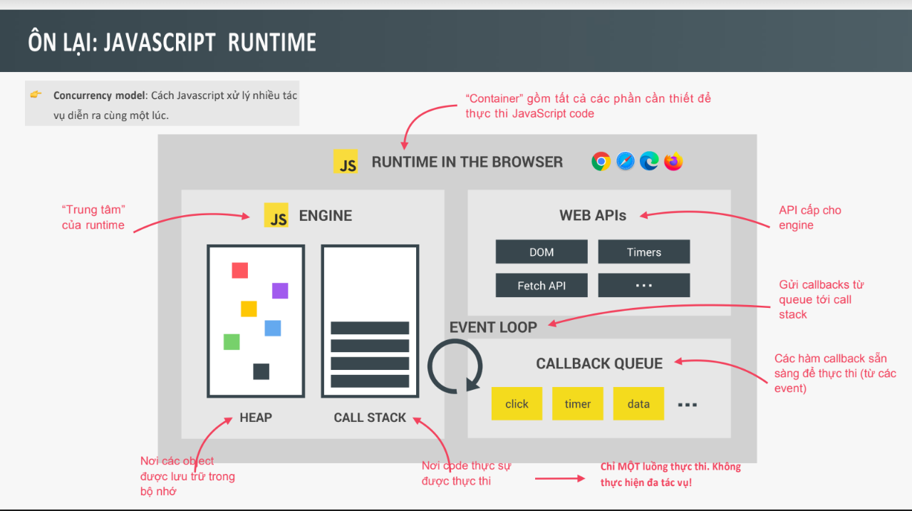
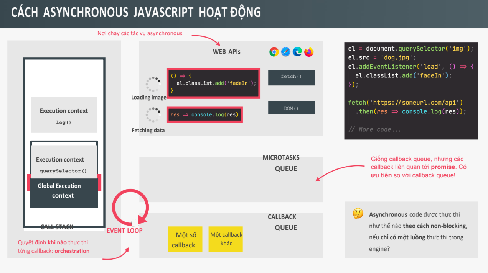

# Bài 16 - Asynchronous JavaScript - Phần 2

## I. Giới thiệu

Tiếp theo bài 15, trong bài học này chúng ta sẽ tìm hiểu sâu hơn về không đồng bộ:

- Phân tích về cơ chế chạy các tác vụ không đồng bộ trên JS runtime
- Sử dụng Promises với Async/Await
- Quản lý lỗi trong xử lý không đồng bộ với try/catch

## II. Asynchronous Java

### 1. Cơ chế đằng sau Asynchronouns : Event Loop

- JS Runtime là 1 container (kiểu như hợp chứa) bao gồm tất cả những thứ cần thiết để thực thi code JS

- Trọng tâm của JS Runtime là JS Engine, đây là nơi code được thực thi (call stack) và là nơi các object được lưu trữ trong vùng nhớ heap

==> Hãy nhớ là JS chỉ có 1 luồng thực thi nên tại một thời điểm nó chỉ thực thi được 1 tác vụ



- Web APIs cũng là một thành phần trong JS Runtime, chứa một số API được cung cấp cho engine (như DOM, fetch,...)

- Callback Queue là cấu trúc dữ liệu chứa tất cả các hàm callback sẵn sàng để thực thi, mỗi khi CallStack trống, thì eventloop nhận lệnh callback từ callback queue và đặt chúng vào callstack để thực thi

- Eventloop là điều cần thiết để khiến các tác vụ bất đồng bộ có thể thực thi trong JS

Từ đó ta cũng có khai niệm non - blocking (không chặn), và mô hình đồng thời ( tức là có thể xử lý nhiều thứ xảy ra cùng 1 lúc )


VD:
code html

```
<!DOCTYPE html>
<html lang="en">
  <head>
    <meta charset="UTF-8" />
    <meta http-equiv="X-UA-Compatible" content="IE=edge" />
    <meta name="viewport" content="width=device-width, initial-scale=1.0" />
    <title>Document</title>
  </head>
  <body>
    <h1>Bài 16</h1>
    
    <script src="script.js"></script>
  </body>
</html>

```

code JS

```
const el = document.querySelector("img");
el.src = "imgs/hinhAnh.jpg";

el.addEventListener("load", () => {
  console.log("Ảnh đã được load xong !");
});

fetch("https://geocode.xyz/52.508,13.381?geoit=json").then((res) =>
  console.log(res)
);

console.log("Đã hoàn thành tất cả các tác vụ !");

```

`Ý nghĩa của Event Loop`

- Event Loop có nhiệm vụ vô cùng quan trọng, đó là việc thực hiện điều phối giữa call satck và callback trong callback queue

- Event loop là yếu tố quyết định chính xác thời điểm mỗi callback được thực thi
- Event loop còn có vai trò điều phối toàn bộ JS Runtime

- Ngôn ngữ JS không có khái niệm thời gian vì mọi thứ bất đồn bộ không xảy ra trong engine, runtime mới là nơi quản lý tất cả các hành vi bất đồng bộ, event loop quyết định code nào sẽ được thực thi tiếp theo. Engine chỉ đơn giản là thực thi code mà nó được nhận

`Tóm tắt lại `

- Hình ảnh nhận tác vụ load bất đồng bộ trong môi trường WEB API thay vì trong call stack

- Thêm sự kiện callback trong sự kiện load hình ảnh, callback này cũng là code bất đồng bộ vì chúng ta chỉ muốn thực thi nó khi ảnh đã được tải

- `addEventListener không đặt hàm callback trong CallBackQueue mà tiếp tục chờ trong web api cho đến khi sự kiện load được hoàn thành`

- `Khi sự kiện load hoàn thành, môi trường webApi đưa callback vào trong CallbackQueue, callback tiếp tục chờ tới lượt`

- `Khi callback đứng ở đầu và call stack đang rỗng, event loop chọn nó và đặt nó vào Call Stack để thực thi`

Tóm lại, môi trường Web Apis, Callback Queue và Event loop giúp cho code bất đồng bộ được thực thi theo cách non-blocking

==> ` Microtask queue`

- Khi sử dung promise, mọi thứ hoạt động hơi khác, giả sử dữ liệu đã được lấy - quá trình fetch đã hoàn thành, các callback liên quan đến promise không đi vào Callback queue mà đi vào một hàng đợi đặc biệt là Microtasks Queue

- Hàng đợi microtask queue có quyền ưu tiên hơn hàng đợi callback, event loop sẽ ưu tiên check callback trong microtask queue trước và thực hiện hết các microtask rồi mới check xuống callback queue thông thường

VD:

```
console.log("Làm việc 1");
setTimeout(() => console.log("Làm việc 2 sau 0 giây"), 0);
setTimeout(() => console.log("Làm việc 3 sau 0 giây"), 0);

Promise.resolve("Làm việc 3").then((res) => console.log(res));

Promise.resolve("Làm việc 4").then((res) => console.log(res));

console.log("Hoàn thành tất cả công việc !");

```

### 2. Sử dụng promise với Async/Await

Tóm lại :

- Trong một hàm async, từ khóa await được sử dụng để chờ đợi kết quả trả về của mệnh đề sau nó, await sẽ ngừng việc thực thi code tại câu lệnh hiện tại cho đến khi câu lệnh hoàn thành.

- Việc ngừng thực thi code trong hàm async không phải là blocking vì hàm này đang chạy bất đồng bộ trong backgound và nó không chặn luồng thực thi chính, không chặn call stack. Await làm chúng ta thấy giống như lập trình đồng bộ thường thấy nhưng về mặt cơ chế chúng là code bất đồng bộ

- Với async/await chúng ta không còn gặp vấn đề với callback hell, có thể thay thế promise với phương thức then thành code trông giống như code đồng bộ bình thường

- Async/await chỉ đơn giản là cú phảp trên phương thức then của promise

- Async/await là giải pháp thay thế cho consuming promise, nó che giấu bản chất thực sự của mọi hoạt động đằng sau cơ chế này

Lưu ý :

- `Hàm async luôn trả về 1 promise`
- Dùng try...catch để xử lý lỗi
- Dùng thorw để ném ra 1 lỗi

### 3. Chạy song song các Promises

Chúng ta có triển khai chạy song song nhiều promise bằng phương thức `promise.all()`

VD:

```
async function myPromise(lat, lng) {
  const res = await fetch(`https://geocode.xyz/${lat},${lng}?geoit=json`);
  const data = await res.json();
  console.log(`Dữ liệu của (${lat},${lng}))`);
  console.log(data);
}

Promise.all([myPromise(52.508, 13.381), myPromise(19.037, 72.873)]);

```

Khi phương thức promise.all() chạy đồng thời song song nhiều promise thì nó sẽ gặp lỗi khi nào ?
Nó sẽ gặp lỗi khi: nếu 1 promise bị từ chối thì `promise.all` cũng bị từ chối

## III. Tổng kết

- Quá trình xử lý các tác vụ không đồng bộ trên JS runtime cùng với sự tham gia của microtask queue và WEB APIs.

- Cách sử dụng `async,await`
- Sử dụng try..catch để xử lý lỗi
- Sử dụng một số phương thức của Promise như `Promise.all()`,`Promise.resolve()`,...
